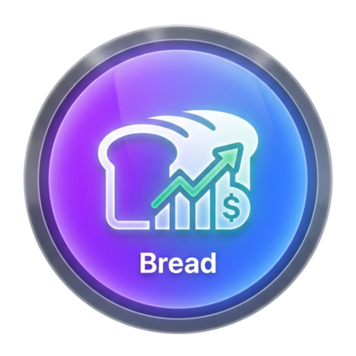
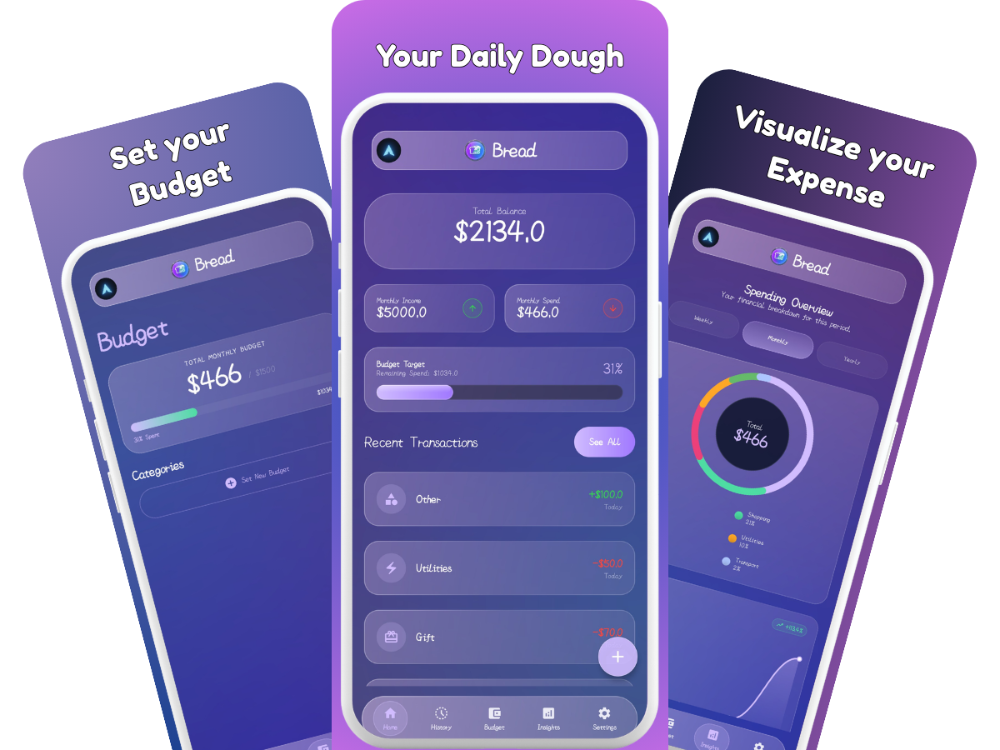

<div align="center">



# Bread

### Your daily dough, managed better

[](LICENSE)
[]()
[]()
[]()

<a href="https://github.com/SilverCipherr/Bread/releases/download/V2.3.5-beta/Bread.2.3.5-beta.apk">
  
</a>

**Bread** is a high-end, privacy-focused personal finance manager for Android. Experience a cutting-edge interface that combines the elegance of iOS 17's glassmorphism with robust, offline-first security.

[Features](#-key-features) • [Screenshots](#-visuals) • [Tech Stack](#-tech-stack) • [Getting Started](#-getting-started)

</div>

---

<div align="center">
  
</div>

## ✨ Key Features

### 🧊 3D Glassmorphism UI

Immerse yourself in a premium interface inspired by iOS 17. Every card, button, and bar features realistic 3D depth, light simulation, and real-time blurring for a truly tactile feel.(Light mode is not implemented yet.)

### 🌈 Immersive Backgrounds

Forget static colors. Bread features dynamic, full-screen animated mesh gradients that flow organically behind your data, bringing your financial dashboard to life.

### 👥 Multi-Profile Support

Switch between different accounts or family members seamlessly. Each profile maintains its own unique set of transactions, budgets, and settings.

### 🛡️ Privacy First

Your data belongs to you. Bread is fully offline-first.
- **No Login Required**: Start managing your finances immediately. No Google sign-in or registration is required to access any of the app's features.
- **Integrated Security**: Secure your information with local PIN and Biometric (Fingerprint/Face) authentication.
- **Seamless Cloud Backup**: Bread leverages Android's system-level Auto Backup. Your data is encrypted and backed up to your personal Google Drive, allowing for easy restoration on new devices without compromising your privacy. It may need at least  24 hours for Google to auto sync the new data when the device is connected to Wi-Fi, charging or idle.

### 📊 Visual Insights

Gain clarity on your spending with beautifully rendered charts. Track your balance trends, monthly income vs. spend, and detailed category breakdowns at a glance.

## 🛠️ Tech Stack

- **UI**: 100% Jetpack Compose with Material 3
- **Language**: Kotlin
- **Architecture**: MVVM with StateFlow
- **Persistence**: SharedPreferences (Encrypted logic)google
- **Image Loading**: Coil
- **Security**: Android Biometric Library

---

## 🚀 Getting Started

### Prerequisites

- Android Studio Ladybug (or newer)
- Android SDK 34+
- Java 11

### Build Instructions

1. Clone the repository:

   ```bash
   git clone https://github.com/SilverCipherr/Bread.git
   ```

2. Open the project in Android Studio.
3. Sync Project with Gradle Files.
4. Run the `:app` module on your device or emulator.

---

## 🤝 Contributing

Contributions are what make the open-source community such an amazing place to learn, inspire, and create. Any contributions you make are **greatly appreciated**. Please see [`CONTRIBUTING.md`](CONTRIBUTING.md) for details.

---

## 📄 License

Distributed under the Apache License 2.0. See [`LICENSE`](LICENSE) for more information.

---

<div align="center">
Made with ❤️ by SilverCipherr
</div>
